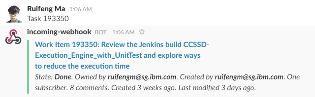

# RTC Work Item Slack Bot

A Slack bot that displays an RTC work item summary when its number is mentioned in a channel. 



# Configuration

Set the following environment variables in the Dockerfile.

`RTC_REPO` - URI of the RTC repository. 

`RTC_USER` - Username of the RTC user to log-in as.

`RTC_PASS` - Password of the RTC user to log-in as. (We prefer not to set this in the dockerfile, rather using a data volume, but you can set this in the dockerfile)

`RTC_BOT_TOKEN` - Bot token for Slack.

`RTC_WEBHOOK` - Webhook to publish attachments (richly formatted text) into Slack.

`RTC_ERROR_CHANNEL` - Slack channel that will be used for status and error reporting.

Optional

`RTC_URI_OVERRIDE` - URI to be used in place of the work item's preferred URI. The string variable '{0}' will be replaced with the work item number. e.g:

```
    https://jazz.net/jazz/web/projects/Rational%20Team%20Concert#action=com.ibm.team.workitem.viewWorkItem&id={0}
```

`WIBOT_VERSION` - version string identifying the version of this RTC work item bot On startup it will be displayed in the error channel.
 
# Run the bot
1. Build the work item bot docker images

    `docker build -t wibot .`
    
2. Store the credential file named 'rtc_pass' in a folder accessible by the docker container as a data volume
3. Run

    `docker run -d -P -v /home/ruifeng/git/docker-rtc-wi-bot/secure:/data/secure --name wibot wibot`
    `docker run -d -P -v /home/ruifeng/git/docker-rtc-wi-bot/secure:/data/secure --net=host --name wibot wibot` (in VirtualBox)

If everything is successful, the error channel you specified will display a startup message. If not, you can read the logs by finding the container id, using docker ps, and then doing docker logs <containerId>.

# Adapted from

[slack-workiteam](https://github.com/ehues/slack-workitems) - A bot that writes RTC work item information into Slack channels.
